<div align="center">


#  Responsive Website for a Virtual Classroom Product <!-- omit in toc -->

[](https://lmcrean.github.io/Hoverboard/) [](https://github.com/lmcrean/Hoverboard/blob/main/testing.md) [](https://github.com/lmcrean/Hoverboard/commits/main) [](https://github.com/lmcrean/Hoverboard/issues?q=is%3Aissue+is%3Aclosed) [](https://github.com/lmcrean/Hoverboard/issues) [](https://github.com/lmcrean/Hoverboard/labels/html) [](https://github.com/lmcrean/Hoverboard/labels/css) 


<br>

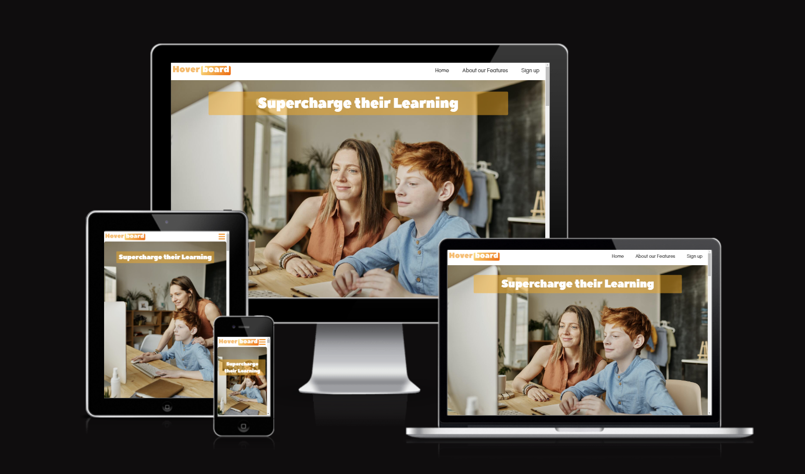

<br>

 **This project presents Hoverboard as an exciting new Virtual Learning Environment for schools.** The key focus for the developer was responsive CSS, using ```flex``` and ```grid``` displays to allow the website to be viewed comfortably on different devices. The design also utilised consistent font pairings, border-styles, padding and color themes to reinforce the tone of the product. The website was designed with a mobile-first approach, using Figma, and then implemented with HTML, CSS and Javascript. *The website was deployed to GitHub pages.*

</div>

***
## Documentation introduction
This readme introduces the key features of the project, using the framework of the 5 planes of User Experience. It summarises key challenges addressed along the way and also provides credits and acknowledgesments at the end.

Testing is summarised in the readme, while a seperate Testing file is dedicated to a more specific technical account.

In the issues I have logged written, video or screenshot accounts.

## Table of Contents <!-- omit in toc -->

- [Features](#features)
- [UX Development Planes](#ux-development-planes)
  - [Strategy Plane](#strategy-plane)
  - [Scope plane](#scope-plane)
  - [Structure Plane](#structure-plane)
  - [Skeleton Plane](#skeleton-plane)
  - [Surface Plane](#surface-plane)
- [Testing](#testing)
- [Manual Testing](#manual-testing)
- [Automatic Testing](#automatic-testing)
- [Validator Testing](#validator-testing)
  - [Lighthouse Report](#lighthouse-report)
- [Fixed bugs](#fixed-bugs)
- [Unfixed Bugs](#unfixed-bugs)
- [Deployment](#deployment)
- [Future features to implement](#future-features-to-implement)
- [Credits](#credits)
  - [Code snippets](#code-snippets)
  - [Technologies Used](#technologies-used)
- [Acknowledgements](#acknowledgements)
      - [Pull request acknowledgements](#pull-request-acknowledgements)

***
# Features

## Navbar <!-- omit in toc -->
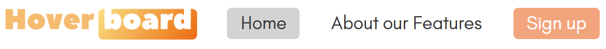

displayed with ```tab-active```, regular and ```:hover``` states

Navigates to all 3 main pages, with a hamburger icon for mobile devices.

***

## Hero Section <!-- omit in toc -->


Introductory section with slogan and background image.

***

## Mission Intro with nested features for teachers <!-- omit in toc -->
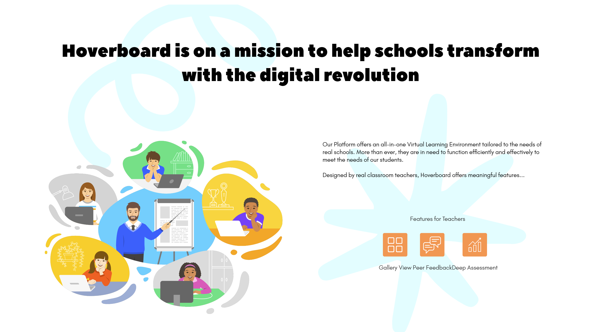

Introduces the company's mission and the product's features. The features are nested in a grid display, with the features intro displayed in a column for mobile devices and a row for larger devices.

***

## Call to Action <!-- omit in toc -->
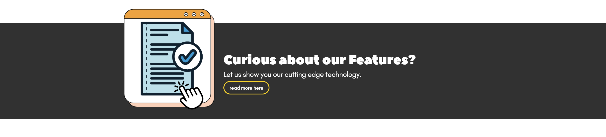

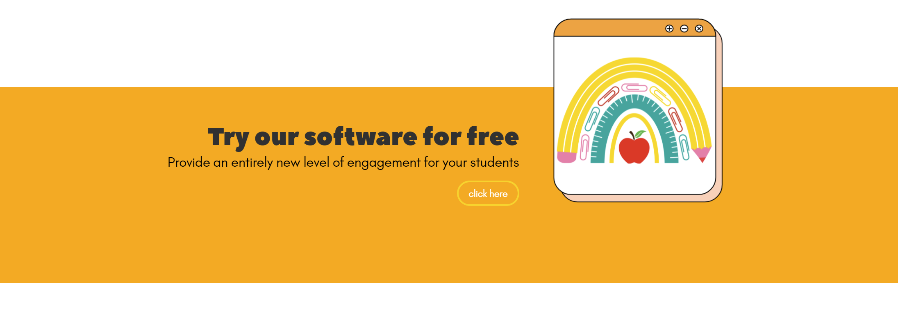

These are inline links to the features page and sign up page.

***

## Testimonials <!-- omit in toc -->
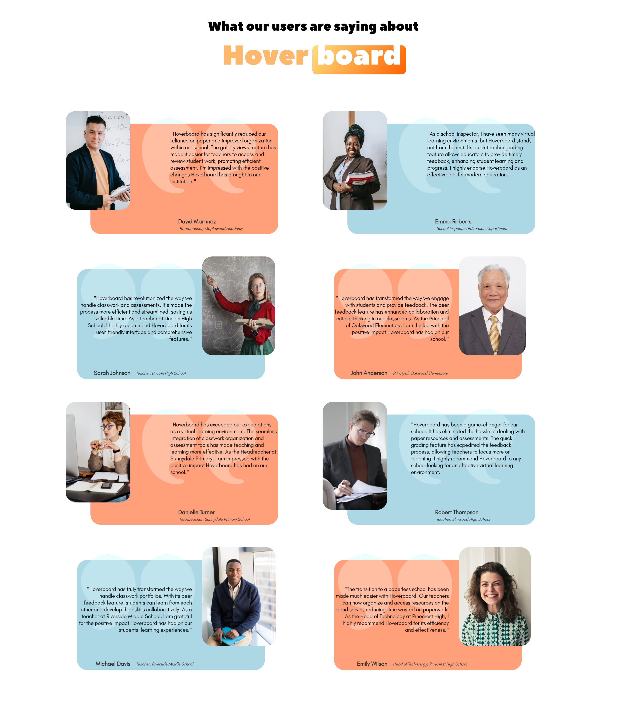

These display quotations from previous users, with their name and title. They are displayed in a column for mobile devices and a 2x4 grid for larger devices.

***

## Headers for Features page, Sign up page and Thank you page <!-- omit in toc -->
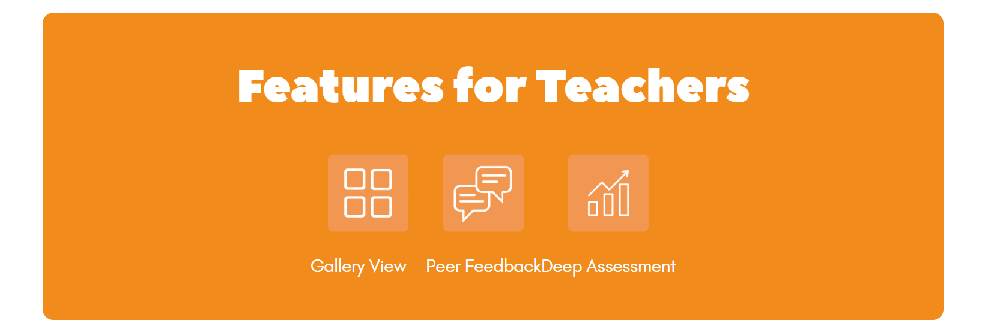
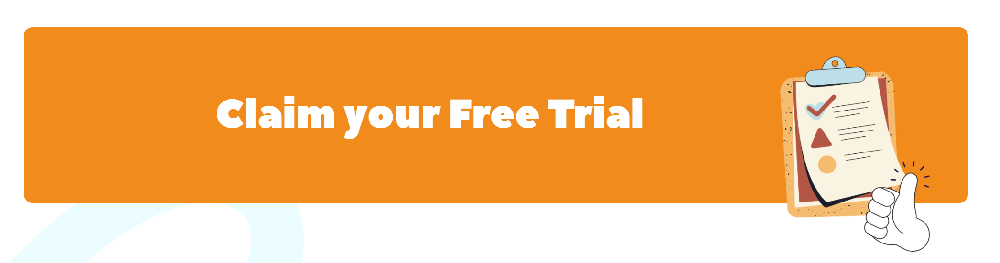
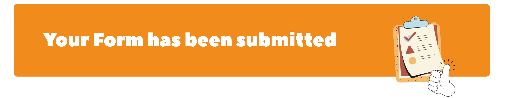

Introduces the page and reinforces the design theme.

***

## About features <!-- omit in toc -->
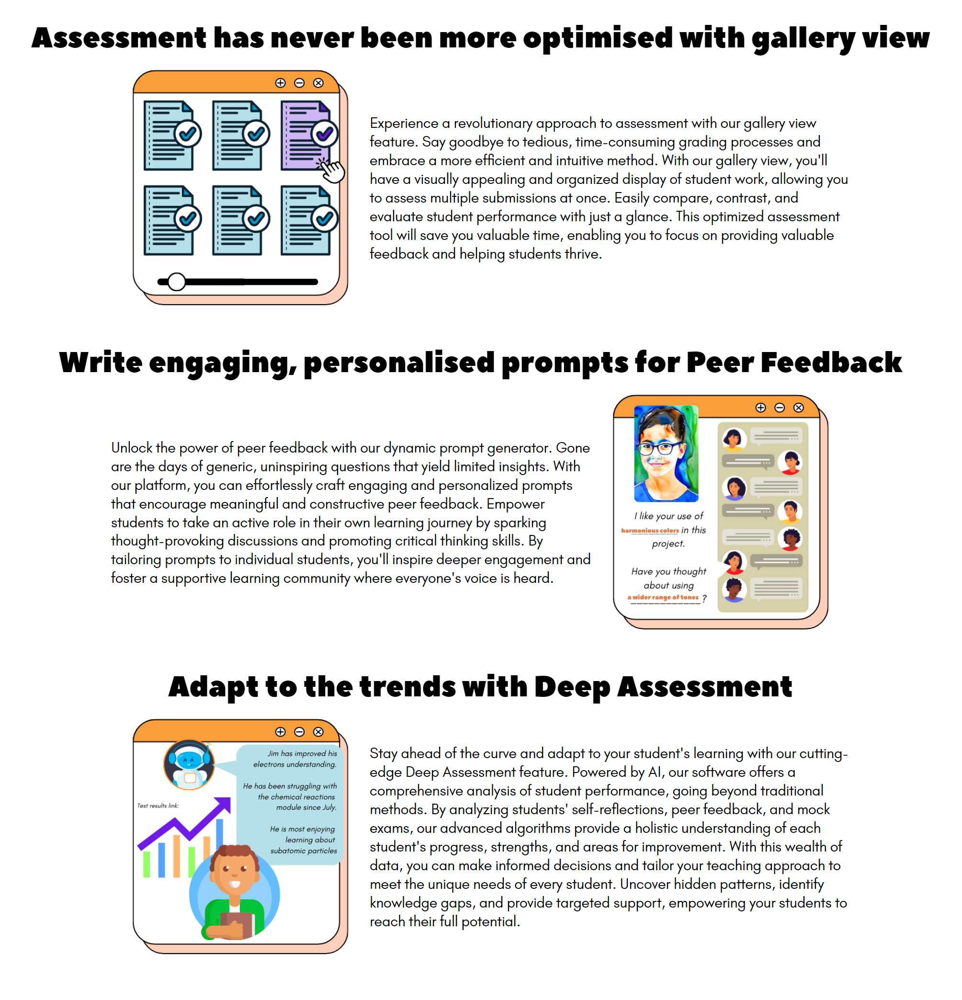

Describes the features of the product, with graphics and text.

***

## Sign Up Form <!-- omit in toc -->
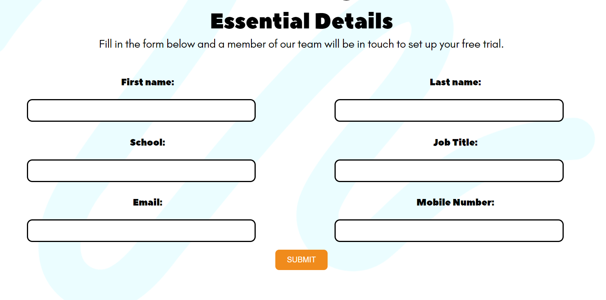

Allows the user to sign up for a free trial of the product. 
The form input requires that the email includes ```@``` and ```.``` and that the mobile number is <font color="green"> 11 digits long.</font>

***

## Footer <!-- omit in toc -->


Provides links to social media websites. Displayed on every page and anchored to the bottom of the page.

***

# UX Development Planes

The 5 UX development planes are for the purpose of explaining the design process of the website. Both intention and outcome are recorded.

The key tool to bridge UX and code was the Figma wireframe: issues are logged here. [](https://github.com/lmcrean/Hoverboard/labels/Figma) [](https://github.com/lmcrean/Hoverboard/issues?q=label%3Acss+label%3A%222%20features%20page%22+is%3Aclosed)

## Strategy Plane

The website itself was aimed at **Education Professionals** such as teachers and headteachers. The design choices factored in to consideration that **students** also use the product. To meet both user needs in the long term, the tone of the product would need to strike a balance between professional and playful. 

The business goals were to **increase the user population** of Education Professionals signing up for a free trial. To achieve this, the website needed to be persuasive, informative and easy for the user to navigate.

The new user is most likely a **Teacher**.

<div align="center"><h3> User Stories</h3> <!-- omit in toc -->

  </div>


New User:
- If I am convinced enough that the product will make my job easier, then I will sign up for a free software trial.
- I need to comfortably access this website on any device such as mobile, tablet, laptop or desktop.
- I need to visualise this product's mission.
- I need to understand the products features and their relevance to my job.
- I need to be able to sign up for a free trial easily. 

***
## Scope plane
The following features were designed to meet the needs of new users.  They were displayed across three main pages, sometimes appearing more than once for the purpose of both making the website easy to navigate and consistent branding design.
<!-- Add thumbnails 3rd column?--->
| Feature       | Function  | Most relevant user story |
| --- | --- | ------- | 
| Navbar <br>|Navigation | - I need to comfortably access this website on any device such as mobile, tablet, laptop or desktop.|
| Footer <br>| Navigation | [promoting businesses' online profile]|
| Hero image with slogan  | Reinforces brand, Visualizes the experience | - I need to visualise this product's mission.|
| Page headings <br><br> | Design appeal and clear navigation | - I need to comfortably access this website on any device such as mobile, tablet, laptop or desktop.|
| Hoverboard's Mission  | Introduces the product persuasively in the context of VLE's, why we're different| - I need to visualise this product's mission.
| Call-to-action: Find out about our Features, claim-your free trial <br> | provides clear links for the user to navigate, | - I need to comfortably access this website on any device such as mobile, tablet, laptop or desktop.<br>- I need to be able to sign up for a free trial easily. |
| Testimonials from different users   | Provides users testimonials, Builds social proof and trust | - If I am convinced enough that the product will make my job easier, then I will sign up for a free software trial. |
| Gallery Views, Peer Feedback, Deep Assessment     <br>        | Visualizes easy navigation of classwork on a browser,student chat function in action, chatbot in action|- If I am convinced enough that the product will make my job easier, then I will sign up for a free software trial.<br>- I need to understand the products features and their relevance to my job.| |
| Form input  | Records essential details: name, address, school. Redirects to thank you page, form method="GET"  |    - I need to be able to sign up for a free trial easily. |

<u>Omissions from the scope</u>
There were a few omissions from the project. Several Javascript features were omitted in the testimonials feature mid-project to prioritise developing the responsivity, such as a carousel and read/more read less button for mobile view. Popular frameworks such as bootstrap were not used in this instance in order for the developer to focus on learning CSS responsivity.


***
## Structure Plane

**This diagram illustrates a page structure with simple and accessible hyperlinks.** The Navbar links to all 3 main pages. There are 3 call-to-action features that include a hyperlink. The submit button takes user to a thank you page, assuming the form is entered correctly.

<div align="center">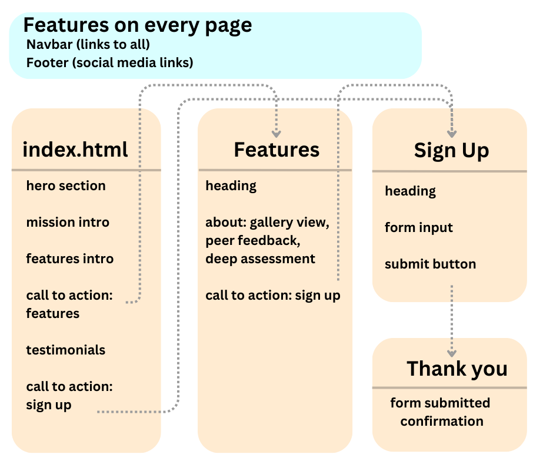</div>


When using the **submit button**, the form input requires that the 
- email includes ```@``` and ```.```
- mobile number is <font color="green"> 11 digits long.</font>

If the form is entered incorrectly on submission, the user will be prompted to adjust the form.
***
## Skeleton Plane

**In the skeleton plane each feature's display changed according to the device size.** As well as adapting to viewport, a sense of depth was achieved by taking background images and discrete overlapping. 

The website was designed with a mobile-first approach, using Figma. The key challenge was to use viewport breakpoints at 768px, 1208px and 1768px to display the website comfortably on different devices.

<div align="center"> <h3> Home page wireframe </h3>
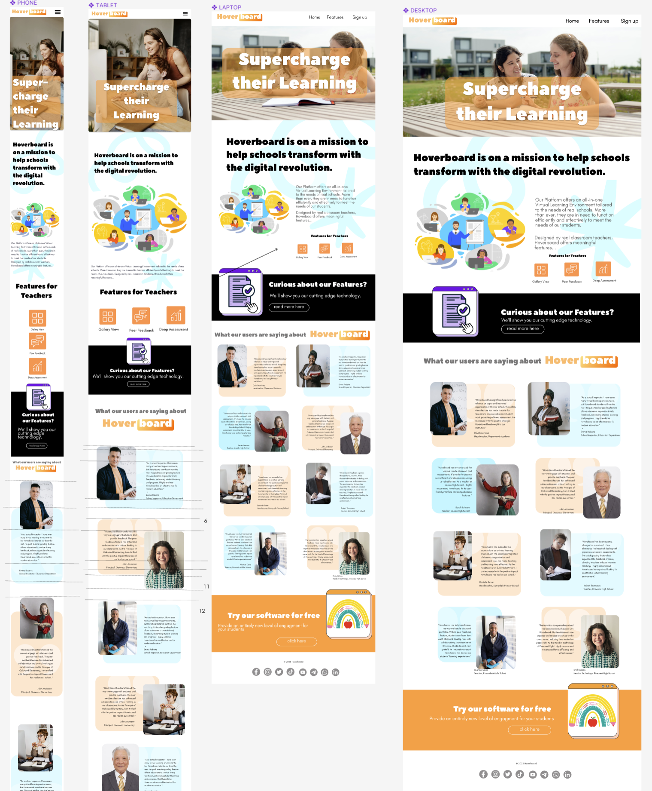
<br>
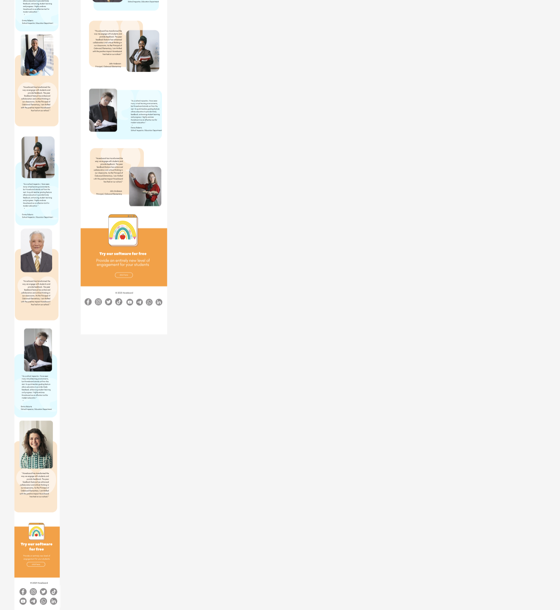

*to view wireframe in more detail, ```right click > open image in new tab```* </div>

#### Navbar (used on all pages) <!-- omit in toc -->
- The Navbar uses an open/close icon menu in the right-corner for mobile devices. 
- The logo is always displayed on the left and the links are always displayed on the right. 
- The links are displayed in a column for mobile devices and a row for larger devices.
#### Footer (used on all pages) <!-- omit in toc -->
- The footer displays social media links in 2 rows for mobile devices and a row for larger devices.
- It is always located at the bottom of the screen.
#### Hero section <!-- omit in toc -->
- The hero section displays a background image with a backgruond color layered on top, then a heading. 
- The feature is displayed in a portrait for mobile devices and a landscape for larger devices. 
- The hero image siwtches to a different image for larger devices, so as to better fit the aspect ratio.
#### Mission intro and Features intro <!-- omit in toc -->
- The mission intro uses CSS grid to rearrange the features according to the device size.
- On larger devices, the content below the heading is split into 2 columns, and the features intro is nested into the 2nd column.
- On smaller devices features intro uses CSS flexbox displays the apps in columns, whereas on larger devices they are rearranged as rows.

#### Call-to-action (also used on features page) <!-- omit in toc -->
- The call to action uses CSS grid to create an appealing **illusion of depth** that the image is slightly **overlapping** the heading banner. The img file starts on an earlier ```grid-template-row: 1 / span 2``` than the banner which starts on row 2.
- On larger device, the call-to-action splits into 2 columns, using ```grid-template-columns: 1.5fr 1fr```  to keep a 2:1 ratio between text and image.
- the text includes heading, paragraph and button. They use ```text-align:``` left or right alowing with ```@media``` queries to switch between left and right alignment.
- Three call-to-actions are displayed throughout the website.

#### Testimonials  <!-- omit in toc -->
- The testimonials use ```CSS grid``` to display 8 testimonials in a single column for mobile devices and a 2x4 grid for larger devices.
- Being a more ambitious use of CSS grid, various class names were used to utilise the **rows, columns and assigned user** in a clear and efficient manner. Example below.
  ```html
  
  <p class="testimonial-text david-martinez grid-group-A tablet-image-on-left  tablet-row-1 laptop-row-1-left laptop-grid-column-2">"Hoverboard has significantly reduced our reliance on paper and improved organization within our school. The gallery views feature has made it easier for teachers to access and review student work, promoting efficient assessment. I'm impressed with the positive changes Hoverboard has brought to our institution."</p>
  <h3 class="testimonial-name david-martinez grid-group-A tablet-image-on-left  tablet-row-1 laptop-row-1-left laptop-grid-column-2">David Martinez</h3>
  <h4 class="testimonial-title david-martinez grid-group-A tablet-image-on-left  tablet-row-1 laptop-row-1-left laptop-grid-column-2">Headteacher, Maplewood Academy</h4>```
-  On the 2x4 grid, the testimonials were divided into ```grid-group-A``` and ```grid-group-B``` classes as there was a more challenging rhythm of the page that couldn't simply copy the positioning from the column view.

<div align="center"> <h3> Features page wireframe </h3> <!-- omit in toc -->
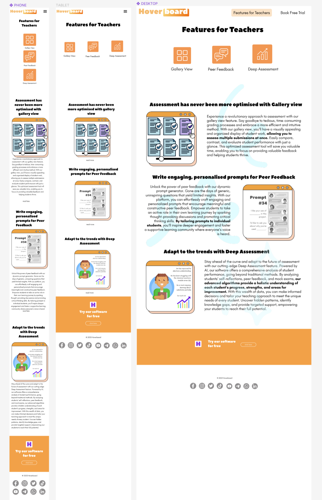

*to view wireframe in more detail, ```right click > open image in new tab```*</div>

### Headings (also used on sign up page and thank you page) <!-- omit in toc -->
- This was a lower priority feature in design and scale of code, serving to introduce the page and reinforce previous design themes.
- would usually switch between columns and rows.
- the features page would borrow ```display:flex``` code from the **app icons** on the home page, as a way of continuing the design motif.
- The sign up and thank you page would utilise the overlapping image effect similar to the call-to-action.
- 
### Description of Features <!-- omit in toc -->
- This was displayed as columns in mobile view.
- On larger devices this used a simple ```display: flex``` to display the icons in a row for mobile devices and a column for larger devices. HTML classes were able to easily switch up the column-order of image and text, to keep the reader engaged.
  ```css
  @media screen and (min-width: 850px) {
  .img-text-wrapper {
    [...]
    flex-direction: row;
  }

  .img-text-wrapper-reverse {
    [...]
    flex-direction: row-reverse;
  }
  ```
<div align="center"> <h3> Sign-up page wireframe </h3>
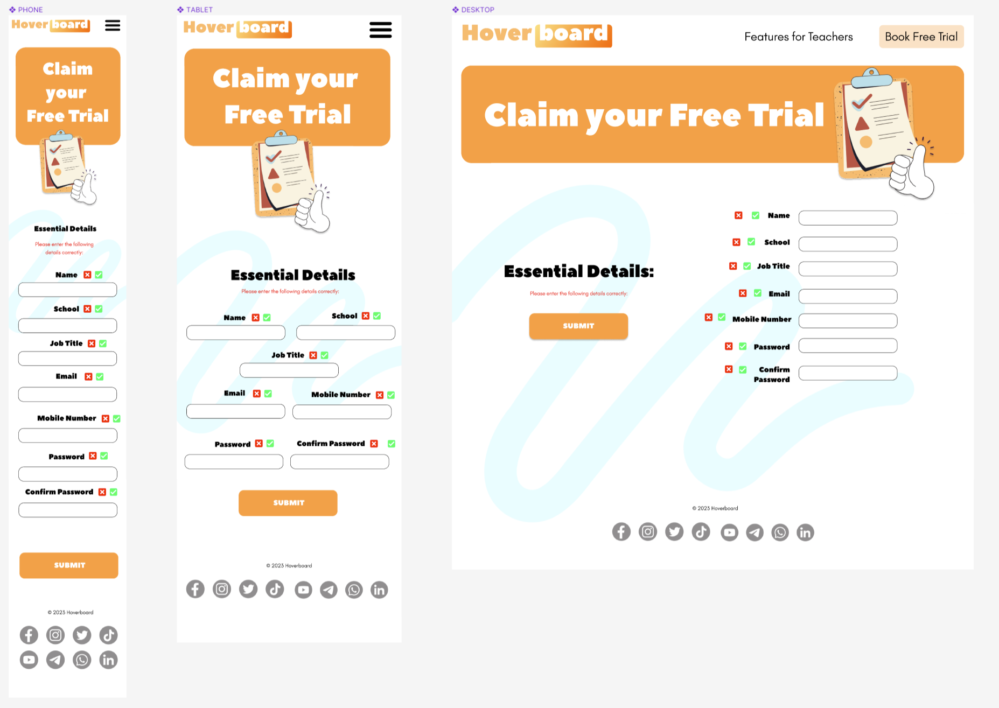

*to view wireframe in more detail, ```right click > open image in new tab```* </div>

### Form input <!-- omit in toc -->
the form input is displays as a column for mobile devices, 2 columns for tablet devices. On largest devices the form is displayed as a column again but on the right hand side.

### Submit button <!-- omit in toc -->
The submit button checks that the form is entered correctly, see structure plane for more details. It is placed underneath the form as the user will be in this area once completing the form. 

***
## Surface Plane
This surface plane describes the choice of typefaces, colors and style themes relevant to the project's desired tone and practical needs.

Typefaces used were Peace Sans for headings and Glacial Indifference for body text. The font pairings were chosen for their playful  but professional tone as outlined in the strategy plane.

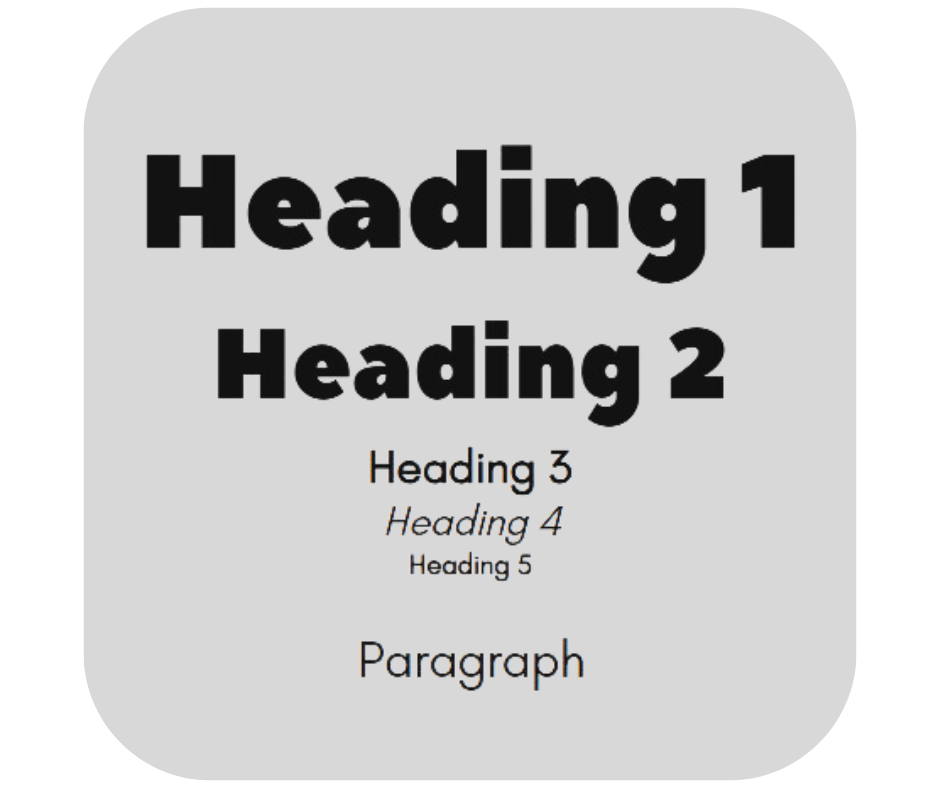

```css
/*These type selectors are all Peace Sans*/
h1, h2, label {
  font-family: 'PeaceSans', sans-serif;
}

/* These type selectors are all Glacial Indifference*/
p, h3, h4, h5, a,
form input{
  font-family: 'glacialindifference', sans-serif;
}

/* these type selectors are all Glacial Indifference, but with some small changes in style*/
h3 {font-weight: 700 !important; /*bolden text*/}
h4 {font-style:italic;/*italicize text*/}
h5 {font-size: 0.7rem;/*reduce font size*/}
```
Regarding font-size, the ```clamp()``` function was mostly used to ensure the font size was responsive to the device size. This was used instead of media queries, as it was more efficient and easier to read, it allowed the media queries to be used more for positioning and to address bugs with the display.

```css
/* The clamp() CSS function clamps a value between an upper and lower bound. It takes three parameters: a minimum value, a preferred value, and a maximum allowed value. [...]*/
h1 { font-size: clamp(1.8rem, 1.3893rem + 2.3467vw, 4rem);}
h2 { font-size: clamp(1.5rem, 1.5rem + 1.2vw, 2.5rem); }
p { font-size: clamp(1rem, 0.9253rem + 0.4267vw, 1.4rem);}
```
***
The color theme was chosen to be consistent with the logo with the aim of creating a consistent brand identity. To speed up efficiency, root variables were used to store the color values. This allowed the color theme to be changed easily in the future.

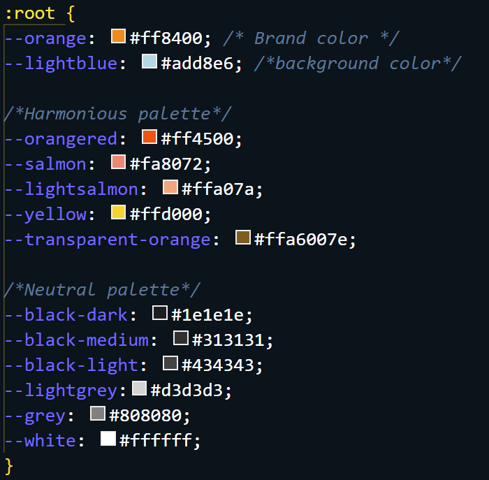

The footer section used black SVG images that were the filtered to match the color theme.
```css 
filter: invert(100%)
```
***
An important design theme was the use of overlapping images and colors, to create a sense of depth.

The ```border-radius``` was chosen to be consistent with the logo and hero image. 
There was also a design motif of images overlapping colors, the use of border-radius and overlapping is clearly illustrated in the testimonials feature and call to action features.

# Testing
This section summarises the testing process in a linear form from manual testing to automatic testing. Further documentation is available in this link: [](https://github.com/lmcrean/Hoverboard/blob/main/testing.md)

# Manual Testing

[](https://github.com/lmcrean/Hoverboard/issues?q=label%3Acss+is%3Aopen) [](https://github.com/lmcrean/Hoverboard/issues?q=label%3Acss+is%3Aclosed) [](https://github.com/lmcrean/Hoverboard/issues?q=label%3Ahtml+is%3Aopen) [](https://github.com/lmcrean/Hoverboard/issues?q=label%3Ahtml+is%3Aclosed)

Manual testing was executed with the following criteria:

- CSS media queries' responsivity to viewport width, key breakpoints being at mobile view, tablet view (768px), laptop view (1208px) and desktop view (1728px+). The videos demonstrate varying viewport widths between 483 to 2500px. Grid and Flex displays were used to switch between differing arrangements of content contributing to the readability.
- Design choices that are similar to those concieved in the [Figma Wireframe, documented here](https://github.com/lmcrean/Hoverboard/wiki/3.-Design-Testing-via-Figma-wireframe). Effective positioning, sizing and style.
- Testing on different browsers, specifically Chrome, Firefox, Edge, Opera and Safari
- test HTML5 Hyperlinks and Forms so that they are all working as expected, identifying potential syntax errors or with the form requirements

# Automatic Testing

The Automatic Testing achieved
* use lighthouse testing to identify files that could be resized and accessibility that can be improved.
* a good lighthouse testing score, particularly for performance, accessibility, best practices.
* Passed W3C Validator Testing for both HTML5 and CSS3, thereby removing excess code and broken links.

# Validator Testing

The W3C Markup Validator and W3C CSS Validator Services were used to validate the project to ensure there were no syntax errors in the project.

The result was <b> <font color="green"> passed </font> </b> for HTML5 and CSS3.

further documentation here: [](https://github.com/lmcrean/Hoverboard/blob/main/testing.md)

## Lighthouse Report

To check the lighthouse report, right click inspect and click on the lighthouse tab. The lighthouse report was run on the home page, features page and sign up page.

To further improve the lighthouse score I could use more WebP images and reduce image sizes.

| | Home Page | Features Page | Sign Up Page |
|---|---|---|---|
| Mobile |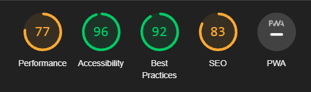  | 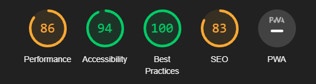 | 
| Desktop |  | 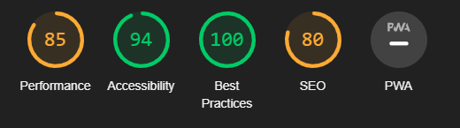 | 
|Timestamp| 31st July '23 | 31st July '23 | 15th July '23 |

# Fixed bugs

The key challenge for this project was responsive design with ```style.css```. 

CSS breakthroughs included formatting images such as ```object-fit: cover``` to fit the hero-picture. the bg-squiggles would not fit in to the viewport and so would.

When using  ```display: grid```, devising a system for switching html elements over using classes with

There were fewer challenges with the HTML form, mainly getting the ```labels``` syntax correct.

Although Javascript was kept to a mininum, one bug realised the DOM wasn't loading without placing the ```<script>``` container at the bottom.

# Unfixed Bugs

While there are no known bugs, there is further code to be modified to improve the user experience.

## Code to be modified <!-- omit in toc -->

- Navbar logo and icon need to shrink on smallest devices, design is crowded.
- positioning of text in testimonials
- add testimonials to sign up page

The navbar animation could be smoother, and this was a 

## Documentation to complete <!-- omit in toc -->
- screen recordings of browserstack tests on different browsers.
- update screen recordings of responsivity tests by feature.

# Deployment
The site was deployed to GitHub pages. You can access the live link [here](https://lmcrean.github.io/Hoverboard/).

# Future features to implement  
- Animations appear on scroll to improve UX
- Dark mode switch to improve accessibility

# Credits

## Code snippets
- W3 School's [Navbar](https://www.w3schools.com/css/css_navbar.asp) was used early in the project and then adapted to meet the design standards set by the Figma wireframe.

- Dominic Fraser from Free Code Camp had an article on fixing footers to the bottom of the screen, which helped with footer issues [Read here](https://www.freecodecamp.org/news/how-to-keep-your-footer-where-it-belongs-59c6aa05c59c/)


## Technologies Used

The main languages used were HTML5 and CSS3. Javascript was also used to for smaller features such as the Navbar hamburger, or read more - read less button.

|Programme| How it was used|
|---|---|
[Canva](https://www.canva.com/) | Designing Hoverboard Logo
[Figma](https://www.figma.com/) | Designing wireframe
[VSCode](https://code.visualstudio.com/) | Code editor
[Github](https://www.github.com/) | Version control

Tools|How it was used|
---|---
[Clamp tool](https://clamp.font-size.app/)| developing a responsive font size with the clamp tool
[amiresponsive](https://ui.dev/amiresponsive)| Checking mobile, desktop, tablet view
[browserstack](https://www.browserstack.com/)| Checking website on firefox, opera, edge, safari and chrome
[gifcap](https://gifcap.dev/)| Recording gifs
[shields.io](https://shields.io/)| Documentation Badges
[FontJoy](https://fontjoy.com/) | Finding font pairings

|Library| How it was used|
|---|---|
[Canva](https://www.canva.com/) | All graphics i.e. non-photographic imagery was designed and adapted from Canva's open source library|
[Pexels](https://www.pexels.com/) | Used for Testimonials user images and the hero images
[Unsplash](https://unsplash.com/) | John Anderson's picture in the testimonial
[Font Awesome](https://fontawesome.com/) | The icons in the footer and navbar were taken from 
[CDN Fonts](https://www.cdnfonts.com/) | Peace Sans and Glacial Indifference fonts sourced


# Acknowledgements
A special thank you to the wonderful tutors at Code Institute, who I consulted for advice throughout the project. I'm deeply grateful for your prompt support.

Special thank you to Seun Owonikoko, my mentor at Code Institute, for your time and patience taking me through devtools. 

#### Pull request acknowledgements
Special thank you to [Syed Anwaar](https://github.com/syed-anwaar) for contributing to this project by addressing an early [.landing-feature img width issue](https://github.com/lmcrean/Hoverboard/pull/22), adding [animation to navbar](https://github.com/lmcrean/Hoverboard/pull/33), contributions to [form-handler.php](https://github.com/lmcrean/Hoverboard/pull/33)

Thank you to [Sahil4883](https://github.com/Sahil4883) for [fixing footer height.](https://github.com/lmcrean/Hoverboard/commit/638a73b8cd1dbfaf1d39b4f19d83126b130c7958) early on in the project.
